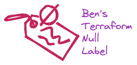

<br/>
<p align="center">
  <a href="https://github.com/bendoerr/terraform-null-label">
    <picture>
      <source media="(prefers-color-scheme: dark)" srcset="docs/logo-dark.png">
      
    </picture>
  </a>

<h3 align="center">Ben's Terraform Null Label Module</h3>

  <p align="center">
    This is how I do it.
    <br/>
    <br/>
    <a href="https://github.com/bendoerr/terraform-null-label"><strong>Explore the docs »</strong></a>
    <br/>
    <br/>
    <a href="https://github.com/bendoerr/terraform-null-label/issues">Report Bug</a>
    .
    <a href="https://github.com/bendoerr/terraform-null-label/issues">Request Feature</a>
  </p>
</p>

 

## About The Project

My opinionated label module.

## Usage

```
module "context" {
  source    = "git@github.com:bendoerr/terraform-null-context?ref=v0.3.0"
  namespace = "brd"
  role      = "production'
  region    = "us-east-1"
  project   = "example'
}

module "label_thing" {
  source  = "git@github.com:bendoerr/terraform-null-label?ref=v0.3.0"
  context = module.context.shared
  thing   = "thing"
}

output "label_id" {
  // brd-prod-ue1-example-thing
  value = module.label_thing.id
}
```

### Requirements

| Name | Version |
|------|---------|
| <a name="requirement_terraform"></a> [terraform](#requirement\_terraform) | >= 0.13 |

### Providers

No providers.

### Modules

| Name | Source | Version |
|------|--------|---------|
| <a name="module_label"></a> [label](#module\_label) | cloudposse/label/null | 0.25.0 |

### Resources

No resources.

### Inputs

| Name | Description | Type | Default | Required |
|------|-------------|------|---------|:--------:|
| <a name="input_context"></a> [context](#input\_context) | Shared Context from Ben's terraform-null-label | <pre>object({<br>    attributes     = list(string)<br>    dns_namespace  = string<br>    environment    = string<br>    instance       = string<br>    instance_short = string<br>    namespace      = string<br>    region         = string<br>    region_short   = string<br>    role           = string<br>    role_short     = string<br>    project        = string<br>    tags           = map(string)<br>  })</pre> | n/a | yes |
| <a name="input_name"></a> [name](#input\_name) | Name of this resource | `string` | n/a | yes |
| <a name="input_project"></a> [project](#input\_project) | Name of the project or application, this can override the context's project | `string` | `""` | no |

### Outputs

| Name | Description |
|------|-------------|
| <a name="output_attributes"></a> [attributes](#output\_attributes) | List of attributes |
| <a name="output_delimiter"></a> [delimiter](#output\_delimiter) | Delimiter between `namespace`, `environment`, `stage`, `name` and `attributes` |
| <a name="output_dns_name"></a> [dns\_name](#output\_dns\_name) | Normalized DNS Name |
| <a name="output_environment"></a> [environment](#output\_environment) | Normalized environment |
| <a name="output_id"></a> [id](#output\_id) | Disambiguated ID |
| <a name="output_label_order"></a> [label\_order](#output\_label\_order) | The naming order of the id output and Name tag |
| <a name="output_name"></a> [name](#output\_name) | Normalized name |
| <a name="output_namespace"></a> [namespace](#output\_namespace) | Normalized namespace |
| <a name="output_project"></a> [project](#output\_project) | Normalized project |
| <a name="output_tags"></a> [tags](#output\_tags) | Normalized Tag map |
| <a name="output_tags_as_list_of_maps"></a> [tags\_as\_list\_of\_maps](#output\_tags\_as\_list\_of\_maps) | Additional tags as a list of maps, which can be used in several AWS resources |


## Roadmap

See the [open issues](https://github.com/bendoerr/terraform-null-label/issues) for a list of proposed features (and known issues).

## Contributing

Contributions are what make the open source community such an amazing place to be learn, inspire, and create. Any contributions you make are **greatly appreciated**.
* If you have suggestions for adding or removing projects, feel free to [open an issue](https://github.com/bendoerr/terraform-null-label/issues/new) to discuss it, or directly create a pull request after you edit the *README.md* file with necessary changes.
* Please make sure you check your spelling and grammar.
* Create individual PR for each suggestion.

### Creating A Pull Request

1. Fork the Project
2. Create your Feature Branch (`git checkout -b feature/AmazingFeature`)
3. Commit your Changes (`git commit -m 'Add some AmazingFeature'`)
4. Push to the Branch (`git push origin feature/AmazingFeature`)
5. Open a Pull Request

## License

Distributed under the MIT License. See [LICENSE](https://github.com/bendoerr/terraform-null-label/blob/main/LICENSE.txt) for more information.

## Authors

* **Benjamin R. Doerr** - *Terraformer* - [Benjamin R. Doerr](https://github.com/bendoerr/) - *Built Ben's Terraform Modules*

## Acknowledgements

* [ShaanCoding (ReadME Generator)](https://github.com/ShaanCoding/ReadME-Generator)
* [CloudPossie (Terraform Null Label - Inspiration)](https://github.com/cloudposse/terraform-null-label)
